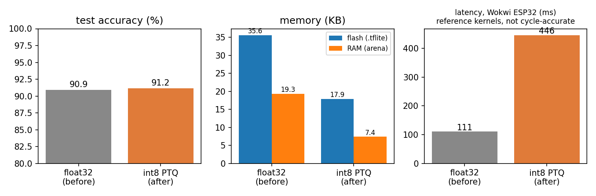
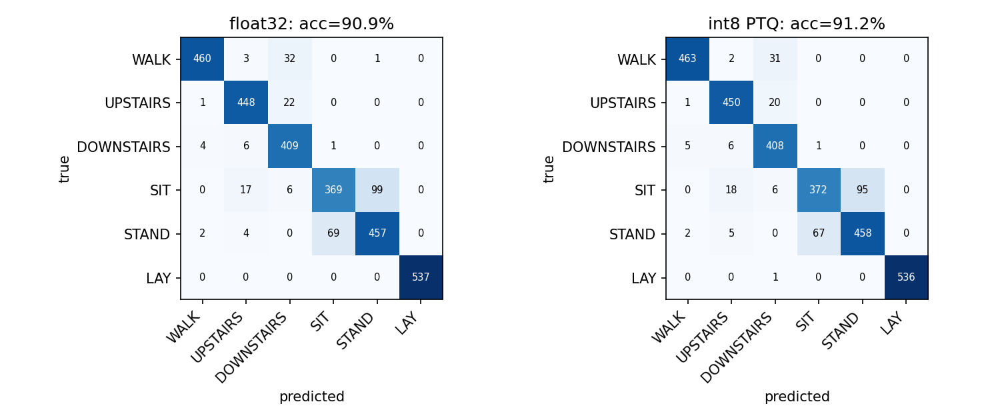
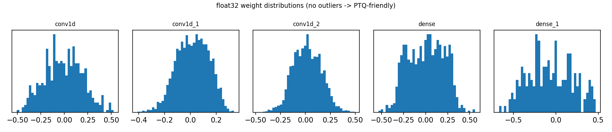

**Repository:** `AIOT/` (see README) · **Wokwi project:** `firmware/esp32_har/diagram.json` · **Results:** `results/summary.md`

# 1. Prototype

## 1.1 Problem and objectives

Wearable and ambient devices that recognise what a person is doing — walking, climbing stairs, sitting, lying down — are the sensing front-end of many AIoT applications: fall detection for elderly care, activity logging for rehabilitation, and context-aware energy management in buildings. The naïve architecture streams raw inertial data to the cloud and classifies it there. For a motion sensor that is a poor design on every axis discussed in the course: a 6-axis IMU at 50 Hz produces a continuous 4.8 kbit/s stream, the radio needed to carry it dominates the energy budget, the round trip adds seconds of response latency, and the raw stream is personally identifiable data leaving the device. The course's privacy principle of *data minimisation* (Chapter 1.6) says that a system should never transmit raw, identifiable data if it can be avoided.

The prototype therefore keeps the intelligence on the device. Its objectives were fixed at the start:

1. **A deliberately designed sensing pipeline** on a microcontroller: a fixed-rate acquisition scheme, a windowing strategy matched to the physical signal, and measurable guarantees that the pipeline delivers what it claims.
2. **An AI model running on the microcontroller itself**, evaluated in a way that does not overstate its accuracy.
3. **One edge-optimisation technique** — post-training quantisation — applied with its actual parameters recorded, and evidence of how it moves the model on the accuracy–latency–size trade-off *for the chosen device*.

The result is an ESP32 that samples an MPU6050 at 50 Hz, classifies each 2.56-second window into six activities with an int8 1D-CNN, shows the result on an OLED and publishes it over MQTT.

## 1.2 Evaluation in the context of Chapter 1.6

Chapter 1.6 argues that a prototype's requirements should be written as *falsifiable design hypotheses* — an operating condition, an observable metric and a pass/fail threshold — rather than as vague goals, and that every iteration of the hardware is an experiment on those hypotheses. I applied that framing to the four properties that matter for an on-device HAR node. Every hypothesis is checked by a counter that the firmware prints; none of them is assumed.

| # | Operating condition | Observable metric | Threshold | Outcome |
|---|---|---|---|---|
| H1 | Continuous operation with inference, display and network active | Measured sampling rate, missed sample deadlines, dropped windows | 50 ± 0.5 Hz, 0 missed, 0 dropped over a run | **Pass** (50.0 Hz, 0, 0) — after three architectural revisions, see §1.3 |
| H2 | Classification of people who are *not* in the training data | Test accuracy on held-out subjects | ≥ 90 % for both float32 and int8 | **Pass** (90.9 % / 91.2 %) |
| H3 | Quantised model on the ESP32 | Accuracy loss vs float32; RAM (tensor arena); flash | ≤ 1 pt loss; arena ≤ 16 KB; both models fit together | **Pass** (+0.24 pt; 7.6 KB; both resident) |
| H4 | Quantised inference on the ESP32 | Processing latency | int8 faster than float32 | **Fails in simulation** (446 ms vs 111 ms) — analysed in §2.3; expected to pass on physical silicon with optimised kernels |

Two other themes of the chapter shaped the design. *Cyber-physical resilience*: the chapter warns that missed real-time deadlines make a model useless regardless of its accuracy, so the sampler was isolated from everything that can block (inference, display, network). *Data integrity and communication*: messages are self-describing JSON with units and the measured sampling rate, avoiding the "what does 45 mean" ambiguity the chapter describes; and the device transmits only the class label, so no motion trace can be reconstructed from the network. The chapter's "ideal network fallacy" is also visible in my logs — the first MQTT integration silently broke the sampler during a one-second TCP connect, exactly the kind of benchtop-only assumption the chapter cautions against.

## 1.3 Development process, iterations and abandoned approaches

**Board.** I chose the ESP32 DevKit-C over the Raspberry Pi Pico and the Arduino Uno. The Uno's 2 KB of RAM cannot hold even the 3 KB sample window. The Pico would fit the int8 model, but the ESP32's 520 KB SRAM allowed me to keep *both* the float32 and the int8 model resident (19.8 KB + 7.6 KB arenas) so that they could be compared on identical inputs, its second core allowed a hard separation between real-time sampling and inference, its two I2C controllers let the sensor and the display live on separate buses, and its Wi-Fi radio made the communication add-on possible. Each of these features ended up being used, which is the justification.

**Data.** Wokwi's MPU6050 is driven by sliders, so it produces a constant vector and cannot generate a gait. I therefore trained on the UCI HAR dataset: 30 subjects wearing a waist-mounted phone with an MPU-class IMU, sampled at 50 Hz, with total acceleration and gyroscope signals — the same physical quantities the MPU6050 delivers. This also fixed the sampling rate and window length of the firmware, because the deployed pipeline must reproduce the training pipeline exactly.

**Iterations.** The path from first idea to working prototype went through six documented revisions:

1. *Model — MaxPooling abandoned.* The first CNN used max-pooling. Training it on the GPU with deterministic operations enabled failed because the max-pool gradient has no deterministic GPU kernel. Rather than give up bit-exact reproducibility, I switched to average pooling; accuracy was unchanged.
2. *Toolchain — TensorFlow 2.16 abandoned.* Its TFLite converter cannot convert Keras-3 `Conv1D` layers. Pinning TensorFlow 2.17.1 fixed it; the pin is recorded in `requirements.txt`.
3. *Firmware — inference in the main loop abandoned.* The first firmware ran inference inside `loop()`. In the simulator an inference takes hundreds of milliseconds, and the log showed 64 missed samples per inference — the sampler was starved. Inference was moved into a FreeRTOS task pinned to core 0, with the sampler alone on core 1.
4. *Firmware — shared I2C bus abandoned.* With inference off the sampler's core, deadlines were still missed once per window. The cause was the OLED refresh (~1 KB over I2C at 400 kHz ≈ 25 ms) holding the bus that the sampler needed for the IMU. The display was moved to the ESP32's second I2C controller, which also removed the need for a mutex.
5. *Firmware — networking in the main loop abandoned.* Adding MQTT to `loop()` reintroduced 36 missed deadlines: the initial DNS + TCP connect blocks for about a second. All networking was moved into the core-0 task. Hypothesis H1 passed only after this change.
6. *Build — `-Os` replaced by `-O2`.* The Arduino default optimises for size; `-O2` reduced simulated inference latency about seven-fold for 14 KB more flash — a size-versus-latency trade-off in miniature.

# 2. Sensing pipeline

## 2.1 Hardware, sensors and communication

**Sensor and signals.** The MPU6050 is a 6-axis MEMS inertial unit with 16-bit outputs. It is configured for ±2 g and ±250 °/s full scale (the ranges of human locomotion) and its on-chip digital low-pass filter is set to 21 Hz. The captured signals are three axes of total acceleration in g (gravity plus body acceleration, which encodes posture) and three axes of angular rate in rad/s (which encodes rotation during gait). The sensor's Z axis is mounted along the dataset's "vertical when upright" axis, and the axis mapping is documented in the firmware.

**Reading mode — polling with a deadline scheduler.** Chapter 1.3 distinguishes streaming, polling and event-based (interrupt-driven) acquisition. Streaming is unnecessary: at 50 Hz the IMU produces 14 bytes every 20 ms, a trivial load for a 400 kHz I2C bus. Interrupt-driven acquisition would be the most energy-efficient choice on hardware, but Wokwi's MPU6050 does not model the INT pin, and the ESP32 is not power-limited in this prototype. I therefore poll, but not naïvely: the sampler keeps a phase-locked deadline (`next = next + 20 000 µs`, never `next = now + 20 000 µs`), so scheduling jitter does not accumulate into drift — the temporal-alignment problem Chapter 1.3 warns about. The firmware counts every deadline missed by more than one period and reports the *measured* rate every second. The course brief notes that a sensor configured for 100 Hz rarely delivers exactly 100 Hz; the design's answer is to measure rather than assume, and H1 in §1.2 is the resulting hypothesis.

**Sampling frequency — 50 Hz, chosen by Nyquist, not by energy.** The energy of human locomotion lies below roughly 15–20 Hz. The Nyquist criterion therefore requires at least 40 Hz; 50 Hz gives margin and matches the training data exactly. The 21 Hz on-chip low-pass filter acts as the anti-aliasing filter, suppressing content above fs/2 = 25 Hz so that fast vibration cannot masquerade as slow motion. This is the opposite regime from the environmental-monitoring topic, where the signal is slow and the sampling period is chosen by the *energy* budget through duty cycling.

**Windowing.** Samples enter a 128 × 6 ring buffer (3 KB). A window of 128 samples is 2.56 s, longer than one gait cycle (~1 s), so every window of a periodic activity contains at least two full cycles. Inference is triggered every 64 new samples (50 % overlap), giving a decision every 1.28 s while halving compute compared with per-sample inference. Both numbers are identical to the dataset's segmentation, so a window seen by the model on the device is statistically the same object it was trained on.

**Pre-processing parity.** The per-channel mean and standard deviation of the training subjects are computed once by the training script and compiled into the firmware (`har_config.h`). The same function standardises a live window and a replayed window, so there is exactly one code path from raw units to model input.

**Concurrency.** The sampler runs in `loop()` on core 1. Inference, the OLED and the network run in a FreeRTOS task on core 0. The IMU is on I2C controller 0 and the OLED on controller 1. If a window is ready while inference is still running, the window is dropped and counted rather than delaying sampling. The result under full load — both models, display refresh, MQTT — is 50.0 Hz, 0 missed deadlines, 0 dropped windows.

**Communication — MQTT publish–subscribe.** Each classified window is published as a ~150-byte JSON message (source, label, both models' predictions, confidences, latencies, measured rate) to `aiot/har/<chip-id>/activity` on a public broker with QoS 0, and a browser dashboard subscribes over WebSockets. Publish–subscribe suits a constrained device because the device never waits for a consumer, needs no server socket, and any number of subscribers can be added without touching the firmware. QoS 0 is appropriate because a lost label is superseded 1.28 s later. The quantitative argument for edge inference is stark: the label channel carries about 6 bit/s of information, the raw IMU stream 4.8 kbit/s. The add-on is not free — the Wi-Fi/TCP stack costs 472 KB of flash (518 → 991 KB) and, as §1.3 recounts, its blocking connect had to be kept off the sampler core.

**Output.** The OLED shows the source, the int8 prediction, both models' confidence and latency, and the measured rate; the serial port emits machine-parseable lines from which every on-device number in this report is generated by a script.

## 2.2 Energy budget (estimate)

The prototype is simulated, so this is an estimate from datasheet values. The MPU6050 draws about 3.9 mA with both sensors on. The ESP32 draws roughly 30–50 mA when active at 240 MHz and 100 mA or more while the radio transmits. The inference duty cycle is 111 ms per 1.28 s window ≈ 9 %; the radio is active for a few milliseconds per window. The design decision that matters most for energy is therefore *what* is transmitted: one label per window instead of 1.5 KB of raw samples per window keeps radio on-time near zero. The obvious next step, not implemented here, is to light-sleep core 0 between windows and to move the IMU to interrupt-driven acquisition so that the sampler core can sleep between samples — the duty-cycling strategy Chapter 1.3 describes for slow sensors, applied at a 20 ms granularity.

## 2.3 On-device AI

**Model.** A small 1D convolutional network: Conv1D(16, k=5) → AvgPool(4) → Conv1D(32, k=5) → AvgPool(4) → Conv1D(32, k=3) → global average pooling → Dense(32) → Dense(6, softmax); 7 446 parameters. A CNN learns its own filters over the time axis, replacing the hand-crafted statistical features of classical HAR, and 7 k parameters is small enough that even the float32 version fits comfortably in RAM — the architecture was sized for the device first. Training: Adam, batch 64, early stopping on the validation subjects, learning-rate reduction on plateau, seed 42, deterministic GPU kernels; 31 epochs in 11 s.

**Evaluation protocol — subject-grouped split.** Chapter 2.3 explains that random splits of continuous sensing data cause *data leakage*: overlapping windows from the same person appear on both sides of the split and the model is rewarded for recognising the person rather than the activity. I therefore partitioned by subject: 17 subjects for training (6 054 windows), 4 for validation and early stopping (1 298), and 9 never seen during development for testing (2 947). The script asserts that the three subject sets are disjoint. All accuracies below are for unseen people, which is what robustness means in the course's sense.

**Optimisation technique — post-training quantisation, actual settings.** Following the chapter's advice to "quantise first" because it is the cheapest step with the largest gain, I applied full-integer PTQ with the TFLite converter:

- operator set `TFLITE_BUILTINS_INT8`; weights int8, symmetric, **per-channel**; activations int8, asymmetric, per-tensor; biases int32; input and output tensors int8 (no float ops remain);
- calibration with 500 representative windows drawn from the training split with a fixed seed;
- resulting input quantisation scale 0.10107 with zero-point −6; output scale 1/256 with zero-point −128.

I chose PTQ rather than quantisation-aware training because the accuracy loss turned out to be zero; QAT would have added training complexity for no measurable benefit. Mixed precision (keeping first/last layers in float) was likewise unnecessary.

**Results before and after.**

| metric | float32 (before) | int8 PTQ (after) | change |
|---|---|---|---|
| test accuracy, 9 unseen subjects (n = 2 947) | 90.94 % | 91.18 % | +0.24 pt |
| macro-F1 | 0.909 | 0.911 | +0.002 |
| float ↔ int8 prediction agreement | – | 99.05 % | |
| weight bytes | 29 784 | 7 446 | 4.0× smaller |
| `.tflite` file in flash | 36 460 B | 18 352 B | 2.0× smaller |
| tensor arena (ESP32 RAM) | 19 792 B | 7 556 B | 2.6× smaller |
| on-device accuracy, 18 replayed windows | 94.4 % | 88.9 % | |
| host ↔ device prediction agreement | 100 % | 94.4 % | |
| processing latency, Wokwi ESP32, 240 MHz, `-O2` | 110.6 ms | 446.4 ms | int8 slower *in simulation* |

*Accuracy.* Quantisation cost nothing: the int8 model is 0.24 points better, which is within run-to-run noise, and the two models agree on 99 % of the 2 947 test windows. Both models share the same weakness, visible in the confusion matrices: about a fifth of SITTING and STANDING windows are swapped. Both are static postures with a near-identical gravity vector, so a 2.56-second window of accelerometer and gyroscope data simply does not contain the information needed to separate them reliably; this is a limitation of the sensing modality, not of the quantisation.

*Why PTQ was lossless — outlier weights and layer sensitivity.* Chapter 2.5 explains that quantisation degrades a model when a layer's weight range is stretched by outliers, leaving too little resolution for the many small, informative weights, and that the damage compounds when the outlier sits in an early layer. I checked this directly: in every layer the largest weight magnitude is at most 3.5 standard deviations from zero (table below), i.e. the weight distributions are compact and approximately Gaussian, and per-channel quantisation gives each output channel its own scale. The resulting int8 step of 0.003–0.0045 is small relative to the weights' spread. The most sensitive layer by this measure is the second convolution (`conv1d_1`, max|w|/σ = 3.33 with the smallest step), which would be the first candidate to keep in higher precision if a loss had appeared.

| layer | weights | min | max | max\|w\| / σ | int8 step |
|---|---|---|---|---|---|
| conv1d | 480 | −0.507 | 0.523 | 2.62 | 0.0040 |
| conv1d_1 | 2 560 | −0.411 | 0.337 | 3.33 | 0.0029 |
| conv1d_2 | 3 072 | −0.477 | 0.493 | 3.48 | 0.0038 |
| dense | 1 024 | −0.533 | 0.561 | 2.79 | 0.0043 |
| dense_1 | 192 | −0.672 | 0.470 | 2.57 | 0.0045 |

*Size.* The weights shrink exactly four-fold, as the chapter predicts for float32 → int8. The `.tflite` file shrinks only two-fold because, on a 7 k-parameter model, the flatbuffer structure and the per-channel quantisation parameters are a large fixed overhead; the ratio would approach 4× for a larger network. The number that matters on the device is RAM: the tensor arena — the scratch memory for activations — drops from 19.8 KB to 7.6 KB (2.6×), because int8 activations are a quarter the size of float32 ones.

*Latency — an honest negative result.* In the Wokwi simulation the int8 model is four times *slower* than float32. Three facts explain this. First, Wokwi is functionally accurate but not cycle-accurate: a micro-benchmark in the repository shows that 170 000 simple float multiply-accumulates take 167 ms of simulated time (about 240 simulated cycles each, where real silicon needs 10–20), and that 64-bit integer arithmetic is four times slower again. Second, the TensorFlow Lite Micro library used here contains only *reference* kernels, whose int8 requantisation step uses 64-bit multiplies — precisely the operation the simulator penalises. Third, on a physical ESP32 with Espressif's ESP-NN kernels the int8 convolution is the accelerated path and is normally several times faster than float. The simulation therefore measures the cost of an unoptimised software path, not of the arithmetic. A secondary observation: enabling MQTT raised float latency from 87 to 111 ms because core 0 now also runs the network stack — processing latency depends on what else shares the core.

*Position on the Pareto frontier.* The course describes the accuracy–latency–size trilemma and the Pareto frontier as the set of configurations where improving one property costs another. On this device, the int8 model *dominates* the float32 model on two axes at equal accuracy: 4× less weight memory and 2.6× less RAM with +0.24 pt accuracy — it is strictly closer to the frontier. On the third axis the outcome depends on the hardware and kernel support beneath the model, which is the most important lesson of the exercise: "moving toward the frontier for your chosen device" is a statement about the device's integer execution path as much as about the model. For the simulated ESP32 with reference kernels, the honest frontier is "int8 for memory, float32 for latency"; for a physical ESP32 with optimised kernels, int8 wins on all three.

*Host versus device.* Running the same 18 held-out windows through the host TFLite interpreter and through the ESP32 gives identical float32 predictions and 17/18 identical int8 predictions. The one difference is a borderline STANDING window (device confidence 0.57, host 0.81) that flips to SITTING; the integer kernels of TFLite and TFLite Micro round their requantisation differently. It is a reminder that a quantised model should be validated on the target, not only on the host.

# 3. Self-reflection

## 3.1 Limitations and future work

- **SITTING versus STANDING.** The dominant error is inherent in a waist-mounted IMU over 2.56 s. Longer context, a barometer, or transition-aware post-processing (the event-based metrics of Chapter 2.3) would be the next step.
- **Live dynamic classes cannot be shown from the simulated sensor.** Wokwi's IMU is slider-driven, so the live path can only demonstrate postures. Walking-type classes are demonstrated by injecting recorded windows from held-out subjects through the identical on-device pipeline; the firmware labels these `INJECT`/`REPLAY` and never presents them as live data. A physical MPU6050 would remove this limitation entirely.
- **Latency is simulator-bound.** The negative latency result is explained but not resolved. Thirty minutes with a physical ESP32 and ESP-NN kernels would complete hypothesis H4.
- **No energy measurement.** §2.2 is an estimate. Sleep modes and interrupt-driven acquisition are the obvious follow-ups.
- **Public broker, no security.** Labels are published in clear to a public broker; anyone subscribing to the topic sees the wearer's activity. Chapter 1.6's security discussion applies: TLS, a private broker and credentials in a secure element would be required before any deployment.
- **Orientation assumption.** The axis mapping assumes the sensor is worn like the dataset's phone. On-device orientation calibration or data augmentation with rotations would make the model robust to placement.

## 3.2 One course concept in depth: grouped (leave-subjects-out) evaluation

*What it means.* When data come from a continuous sensing process, consecutive samples are not independent: overlapping windows from the same person, device or session share fine-grained characteristics — gait rhythm, sensor bias, posture habits. A random train/test split scatters those correlated windows across both sides, and the evaluation leaks information: the model can score well by recognising the *source* rather than the *activity*. Grouped evaluation conditions the split on the variable that causes the dependency — here, the subject — so that every test window comes from an entity the model has never seen. Leave-one-subject-out cross-validation is the strict form; a fixed held-out subject set is the lighter form.

*Why it matters for AIoT.* The course frames evaluation as answering "does it actually work?" for a device that will be deployed on people, environments and hardware units that were not in the lab. Accuracy under a leaky protocol is not a prediction of field performance; accuracy under a grouped protocol is an estimate of *robustness* in the course's sense. For an edge system this also protects the optimisation study: if the baseline number is inflated by leakage, the "accuracy loss after quantisation" becomes meaningless.

*How I applied it.* The dataset's 30 subjects were split 17/4/9 into disjoint training, validation and test sets, with an assertion in the code that no subject appears twice. Early stopping used the validation subjects, so the test subjects influenced nothing. Every accuracy in this report — float32, int8, host, device — is therefore for unseen people. The 18 replay windows in the firmware are drawn from the test subjects for the same reason.

*What I observed.* The training accuracy reached 97 % while the unseen-subject accuracy settled at 91 %; that six-point gap is the honest cost of generalising across people, and it is exactly the gap a random split would have hidden. It also made the SITTING/STANDING confusion visible as a *cross-subject* problem — different people sit and stand in slightly different postures — rather than something a model could memorise away.

## 3.3 How my understanding of AIoT evolved

I started this course thinking of an AIoT device as "a small computer that runs a model", and of the project as a model-compression exercise. Building the prototype moved the centre of gravity to the *system*. The model took an afternoon; the sensing pipeline took three architectural revisions before it met a requirement as basic as "sample at 50 Hz while doing everything else". Quantisation, which I expected to be the headline, turned out to be almost free on the accuracy axis and to depend on the execution path for the latency axis — the optimisation technique cannot be judged apart from the device it runs on. The evaluation protocol shaped what I could honestly claim, and the communication design was where the real energy and privacy arguments for edge AI became concrete numbers. The chapter that changed my working method most was 1.6: writing requirements as hypotheses with a counter behind each turned debugging from guesswork into experiments, and it is why the missed-deadline counter — not the confusion matrix — is the number I am proudest of in this project.

# 4. Declaration of AI-tool use

**AI tool used:** Claude Code (Anthropic), model Claude Opus 5 (`claude-opus-5`), September 2026.

**Purpose:** pair-programming and troubleshooting throughout the project — scaffolding the training, quantisation and export scripts and the ESP32 firmware; diagnosing toolchain problems (the TensorFlow 2.16 converter bug, the non-deterministic GPU pooling kernel); running and interpreting Wokwi simulations; and drafting this report from the project's results and the course material. The choices of topic, board, optimisation technique and evaluation protocol were made by the author.

# References

1. D. Anguita, A. Ghio, L. Oneto, X. Parra, J. L. Reyes-Ortiz, "A Public Domain Dataset for Human Activity Recognition Using Smartphones", ESANN 2013 (UCI HAR dataset).
2. Course material, *Developing the Artificial Intelligence of Things*: Chapter 1.3 (Sensors and Sensing), 1.4 (IoT Communications), 1.6 (Prototype Evaluation), 2.3 (AI Evaluation in AIoT), 2.5 (AI on the Edge).
3. TensorFlow Lite, *Post-training integer quantization* and *TensorFlow Lite for Microcontrollers* documentation.
4. InvenSense, *MPU-6000/MPU-6050 Product Specification* and *Register Map*.
